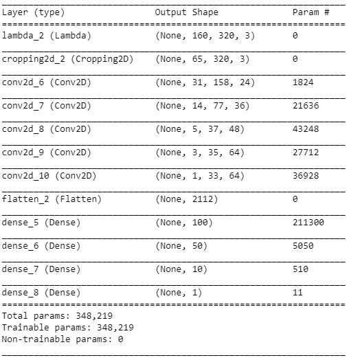
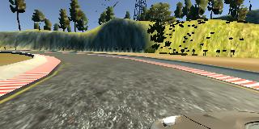
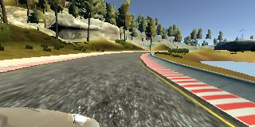
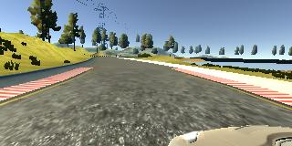
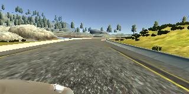

# **Behavioral Cloning** 

## Writeup

---

**Behavioral Cloning Project**

The goals / steps of this project are the following:
* Use the simulator to collect data of good driving behavior
* Build, a convolution neural network in Keras that predicts steering angles from images
* Train and validate the model with a training and validation set
* Test that the model successfully drives around track one without leaving the road
* Summarize the results with a written report

## Rubric Points
### Here I will consider the [rubric points](https://review.udacity.com/#!/rubrics/432/view) individually and describe how I addressed each point in my implementation.  

---

### How to execute the code
Clone the whole repository and navigate the terminal to the project repository.

(If you want to train the project again yourself) Execute the model.py file to train the model.
```sh
python model.py
```

To run the self-driving mode, run
```sh
python drive.py model.h5
```

Switch on the simulator, choose appropriate screen resolution and graphic (recommend fastest for best performance)

To record the video of the car running in simulator, where run1 is the directory of the images you will capture to make video (you can change to your liking directory)
```sh
python drive.py model.h5 run1
```

Then output the video, run
```sh
python video.py run1
```

Optionally, you can specify the FPS (frames per second) with
```sh
python video.py run1 --fps 48
```
This will run at 48 FPS. The default FPS is 60.


### Files Submitted & Code Quality

#### 1. Submission includes all required files and can be used to run the simulator in autonomous mode

My project includes the following files:
* model.py containing the script to create and train the model
* drive.py for driving the car in autonomous mode
* model.h5 containing a trained convolution neural network 
* README.md summarizing the results

#### 2. Submission includes functional code
Using the Udacity provided simulator and my drive.py file, the car can be driven autonomously around the track by executing 
```sh
python drive.py model.h5
```

#### 3. Submission code is usable and readable

The model.py file contains the code for training and saving the convolution neural network. The file shows the pipeline I used for training and validating the model, and it contains comments to explain how the code works.

### Model Architecture and Training Strategy

#### 1. An appropriate model architecture has been employed

My model consists of five convolution layers, a flatten layer and four fully connected layers.

The model includes ELU layers to introduce nonlinearity. The data is normalized in the model using a Keras lambda layer and the images are cropped from top and bottom to cut out unnecessary parts of images in order to reduce complexity fed into the network.

#### 2. Attempts to reduce overfitting in the model

The model was trained and validated on different data sets to ensure that the model was not overfitting. The model was tested by running it through the simulator and ensuring that the vehicle could stay on the track.

#### 3. Model parameter tuning

I tested the model on different batch size (16, 32 and 64) to yield different ouput. Batch size 16 turned out to be the fastest to train and most optimized for the car to stay on the track.

The model used an adam optimizer, so the learning rate was not tuned manually.

#### 4. Appropriate training data

Training data was chosen to keep the vehicle driving on the road. I used a combination of center lane driving, recovering from the left and right sides of the road, and smooth driving along curves to train the model.

For details about how I created the training data, see the next section. 

### Model Architecture and Training Strategy

#### 1. Solution Design Approach

The overall strategy for deriving a model architecture was to reduce validation and training loss.

My first step was to use a convolution neural network model similar to the NVIDIA Self-Driving Car paper (https://developer.nvidia.com/blog/deep-learning-self-driving-cars/).
I thought this model might be appropriate because it has been tested out and validated by the NVIDIA deep learning team and yield robust results.

In order to gauge how well the model was working, I split my image and steering angle data into a training and validation set with the proportion of 80% for training and 20% for vailidating. I found that my first model (model2.h5) had a low mean squared error on the training set but a high mean squared error on the validation set. This implied that the model was overfitting.

To combat the overfitting, I modified the model so that the pooling layer and dropout layer are omitted, and the batch size reduced from 32 to 16. I achieved the latest model (model.h5) with the satisfied requirements.

The final step was to run the simulator to see how well the car was driving around track one. With the initial model, there were a few spots where the vehicle fell off the track and ran straight to the river. However, the latest model fixed this issue, generated a perfect driving motion with smoothness and never went off the track.

At the end of the process, the vehicle is able to drive autonomously around the track without leaving the road.

#### 2. Final Model Architecture

The final model architecture (model.py lines 88-130) consisted of a convolution neural network with five convolution layers, one flatten layer and four fully connected layers.

Here is a visualization of the architecture

[//]: # (Image References)



#### 3. Creation of the Training Set & Training Process

To capture good driving behavior, I first recorded three laps on track one using center lane driving. Here is an example image of center lane driving:

[//]: # (Image References)


I then recorded the vehicle recovering from the left side and right sides of the road back to center so that the vehicle would learn to steer back to the center of the track without going off. These images show what a recovery looks like:

[//]: # (Image References)




To augment the data sat, I also flipped images and angles thinking that this would create more images for the network to learn. For example, here is an image that has then been flipped:

[//]: # (Image References)




After the collection process, I had almost 35000 data image. I then preprocessed this data by normalize the image pixel values between 0 and 1, and then crop the top 70 and bottom 25 pixels to omit unnecessary information.

I finally randomly shuffled the data set and put 20% of the data into a validation set. 

I used this training data for training the model. The validation set helped determine if the model was over or under fitting. The ideal number of epochs was 3. I used an adam optimizer so that manually training the learning rate wasn't necessary.


### Result

I got the training loss of around 0.005 and validation loss of around 0.01. Those values are very small and satisfied my expectations.

Here is the [video](https://youtu.be/cEpgllobh8g) of the car driving in autonomous mode on the simulator. You can also see the project_video.mp4 in the repository.


### Possible improvement

Collecting more data in different tracks can generate even more robust driving behavior when training the model.

Modifying the CNN model (different batch size, different optimizor, more layers and preprocessing steps, etc) to yield lower loss, shorter training time and better performance.

Modifying the drive.py file to generate different driving style using throttle, brakes, yaw, etc to add complexity and more human-like driver.
